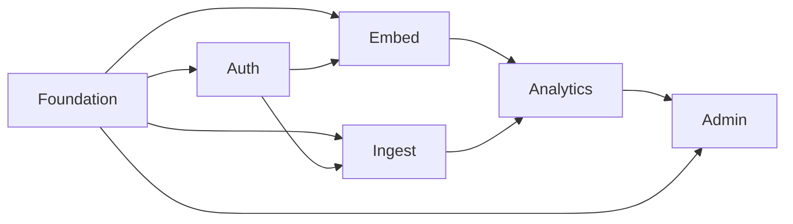

# Canvas Implementation Plan Index

This index breaks the approved `canvas` design into subsystem plans that can be executed independently but in sequence.

## Current execution baseline (v2: app-scoped model)

Spec:

- `/Users/sylvain/Work/canvas/docs/superpowers/specs/2026-03-22-canvas-app-portal-and-embed-viewer-design.md`

Recommended execution order:

1. `/Users/sylvain/Work/canvas/docs/superpowers/plans/2026-03-22-canvas-auth-app-context-plan.md`
2. `/Users/sylvain/Work/canvas/docs/superpowers/plans/2026-03-22-canvas-dashboard-distribution-plan.md`
3. `/Users/sylvain/Work/canvas/docs/superpowers/plans/2026-03-22-canvas-portal-plan.md`
4. `/Users/sylvain/Work/canvas/docs/superpowers/plans/2026-03-24-canvas-portal-shadcn-mvp-plan.md`
5. `/Users/sylvain/Work/canvas/docs/superpowers/plans/2026-03-27-canvas-portal-shadcn-console-plan.md`
6. `/Users/sylvain/Work/canvas/docs/superpowers/plans/2026-03-22-canvas-embed-sdk-viewer-plan.md`

Why this order:

- `Auth and App Context` establishes `amtoken` to app-scoped principal context and app switching.
- `Dashboard Distribution` defines visibility and per-user selection semantics used by both Portal and SDK.
- `Canvas Portal` then builds management and authoring UX on stable backend semantics.
- `Portal Shadcn MVP` refines the Portal into the concrete login and management experience that can be used for day-to-day validation.
- `Portal Shadcn Console Redesign` upgrades that MVP into the denser sidebar-based console the product actually wants.
- `Embed SDK Viewer` finalizes host-facing read/selection UX with minimized churn.

## Recommended execution order

1. `/Users/sylvain/Work/canvas/docs/superpowers/plans/2026-03-13-canvas-foundation-platform-plan.md`
2. `/Users/sylvain/Work/canvas/docs/superpowers/plans/2026-03-13-canvas-auth-tenancy-plan.md`
3. `/Users/sylvain/Work/canvas/docs/superpowers/plans/2026-03-13-canvas-embed-experience-plan.md`
4. `/Users/sylvain/Work/canvas/docs/superpowers/plans/2026-03-13-canvas-ingestion-datasets-plan.md`
5. `/Users/sylvain/Work/canvas/docs/superpowers/plans/2026-03-13-canvas-analytics-realtime-plan.md`
6. `/Users/sylvain/Work/canvas/docs/superpowers/plans/2026-03-13-canvas-admin-delivery-plan.md`

## Why this split

- `Foundation Platform` creates the monorepo, shared packages, local tooling, and base infrastructure contracts that every other subsystem depends on.
- `Auth and Tenancy` establishes the trust boundary, tenant context, and RBAC model that must exist before any product features are safe.
- `Embedded Experience` gives host applications a native integration surface and establishes the UI shell, theme system, and session bootstrap path.
- `Ingestion and Datasets` creates the first meaningful product value: data enters the platform, is normalized, and becomes queryable.
- `Analytics and Realtime` turns normalized data into charts, workbooks, dashboards, and live updates.
- `Admin and Delivery` adds tenant operations, internal controls, and production deployment assets on Kubernetes.

## Dependency map

## Backend alignment note

All backend-facing subsystem plans now assume a single `canvas-backend` project with two runtime modes:

- `API mode`
- `Worker mode`

The file paths and task names below should stay consistent with that modular-monolith packaging model.

## Historical plans (v1)

The `2026-03-13` plan set below remains as historical context, but new implementation work should follow the v2 app-scoped baseline above.

## Execution guidance

- Execute one plan at a time.
- Keep each plan on its own branch or worktree if a git repository is initialized.
- Do not start `Analytics and Realtime` before both `Embedded Experience` and `Ingestion and Datasets` are green.
- If you want, the next step is to execute plan 1 with `subagent-driven-development` or `executing-plans`.
