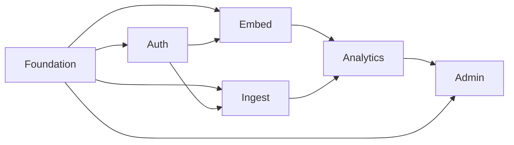

# Canvas Implementation Plan Index

This index breaks the approved `canvas` design into subsystem plans that can be executed independently but in sequence.

## Recommended execution order

1. `/Users/sylvain/Work/canvas/docs/superpowers/plans/2026-03-13-canvas-foundation-platform-plan.md`
2. `/Users/sylvain/Work/canvas/docs/superpowers/plans/2026-03-13-canvas-auth-tenancy-plan.md`
3. `/Users/sylvain/Work/canvas/docs/superpowers/plans/2026-03-13-canvas-embed-experience-plan.md`
4. `/Users/sylvain/Work/canvas/docs/superpowers/plans/2026-03-13-canvas-ingestion-datasets-plan.md`
5. `/Users/sylvain/Work/canvas/docs/superpowers/plans/2026-03-13-canvas-analytics-realtime-plan.md`
6. `/Users/sylvain/Work/canvas/docs/superpowers/plans/2026-03-13-canvas-admin-delivery-plan.md`

## Why this split

- `Foundation Platform` creates the monorepo, shared packages, local tooling, and base infrastructure contracts that every other subsystem depends on.
- `Auth and Tenancy` establishes the trust boundary, tenant context, and RBAC model that must exist before any product features are safe.
- `Embedded Experience` gives host applications a native integration surface and establishes the UI shell, theme system, and session bootstrap path.
- `Ingestion and Datasets` creates the first meaningful product value: data enters the platform, is normalized, and becomes queryable.
- `Analytics and Realtime` turns normalized data into charts, workbooks, dashboards, and live updates.
- `Admin and Delivery` adds tenant operations, internal controls, and production deployment assets on Kubernetes.

## Dependency map

## Execution guidance

- Execute one plan at a time.
- Keep each plan on its own branch or worktree if a git repository is initialized.
- Do not start `Analytics and Realtime` before both `Embedded Experience` and `Ingestion and Datasets` are green.
- If you want, the next step is to execute plan 1 with `subagent-driven-development` or `executing-plans`.
