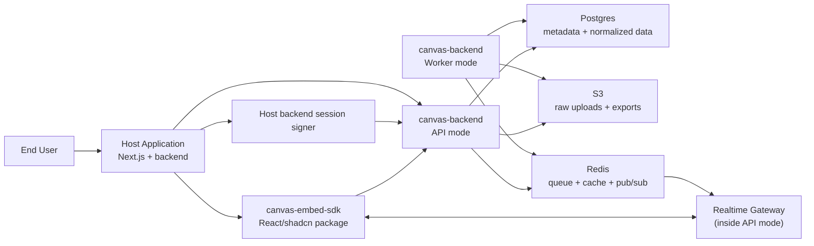
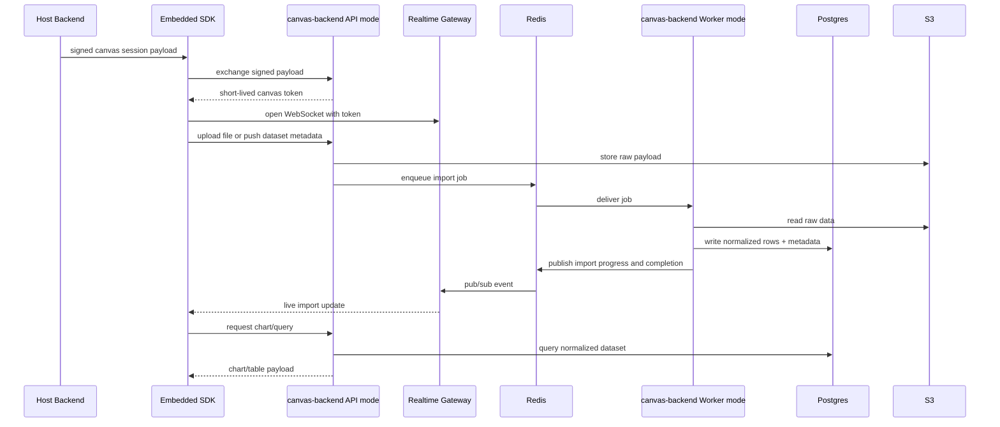
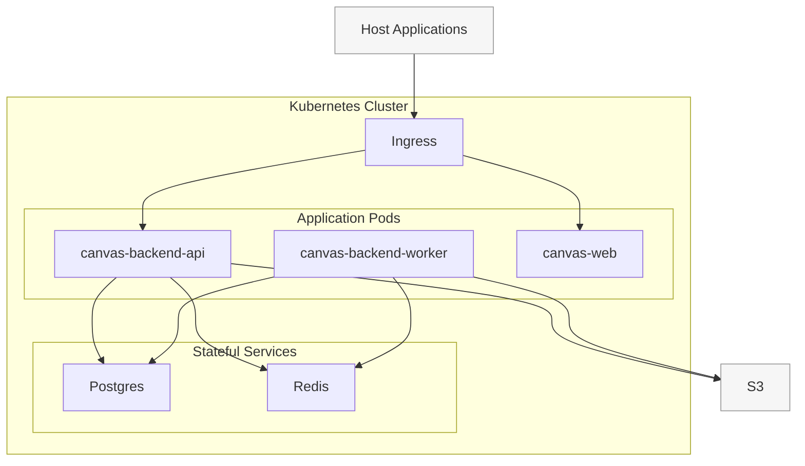

# Canvas Design Spec

Date: 2026-03-13
Status: Draft approved in conversation
Scope: Day-one platform architecture and product definition

## 1. Product Summary

`canvas` is a hosted, multi-tenant BI and visualization platform that feels like a native part of another application's product experience.

It is designed to:

- receive data from end users or host applications
- normalize and store that data inside `canvas`
- let users explore data and build charts, workbooks, and dashboards
- deliver the UI as an embeddable frontend package for host applications
- support delegated identity, white-label branding, and tenant-scoped permissions
- keep the visualization experience live through WebSocket-driven updates

This is not just a chart widget. It is a full BI product, similar in spirit to Tableau or Superset, but delivered as a hosted platform that can be embedded natively into other full-stack applications.

## 2. Goals

### Primary goals

- Build a hosted BI platform from day one
- Allow host applications to embed `canvas` natively without iframes
- Support multi-tenant operation on shared infrastructure
- Accept data through file uploads and application-driven API ingestion
- Normalize imported data for analytics and visualization
- Offer live, realtime data visualization and job status updates
- Support white-label branding so the experience feels native to each host product

### Non-goals for day one

- Direct connections to customer-managed databases
- Dedicated per-tenant infrastructure
- ClickHouse or a separate analytical warehouse
- Full distributed tracing or OpenTelemetry rollout
- Independent end-user authentication owned by `canvas`

## 3. Product Shape

### What the software looks like

For host developers:

- install a frontend package into their Next.js application
- add a backend session-signing endpoint
- optionally push data into `canvas` through an API
- configure branding, feature visibility, and permissions for their tenant

For end users:

- open an analytics workspace inside the host application
- upload files or explore data pushed from the host application
- create charts, workbooks, and dashboards
- see live updates for imports, query progress, and dashboard refreshes

For `canvas` operators:

- manage tenants, quotas, jobs, storage, branding, and internal support tools

## 4. High-Level Architecture

`canvas` is split into six logical layers:

1. Embedded experience layer
2. API and session layer
3. BI application layer
4. Ingestion and normalization layer
5. Query and visualization layer
6. Platform infrastructure layer

### System context diagram

## 5. Day-One Services

### Frontend

- `canvas-embed-sdk`
  - React component and screen package
  - built for Next.js host applications
  - uses shadcn/ui primitives and tenant theme tokens
- `canvas-web`
  - optional web surface for tenant admin and internal operator views

### Core backend

- `canvas-backend`
  - one Node.js/TypeScript backend project
  - one Docker image
  - shared modules for auth, tenant context, datasets, ingestion, query, charts, dashboards, workbooks, and realtime

### Runtime modes

- `API mode`
  - main REST/JSON application API
  - validates signed host session assertions
  - issues short-lived `canvas` access tokens
  - handles datasets, uploads, dashboards, charts, workbooks, tenant config, and permissions
  - exposes WebSocket realtime communication for live updates
- `Worker mode`
  - runs asynchronous jobs using Redis-backed queues
  - parses uploaded files or app-pushed data payloads
  - performs normalization and import workflows
  - handles export and other background processing

### What `api-gateway/app-api` means

For day one, the public API surface is implemented inside `canvas-backend` API mode:

- gateway responsibilities
  - auth verification
  - tenant context enforcement
  - rate limiting
  - request routing
- application API responsibilities
  - BI product business logic
  - datasets, dashboards, charts, workbooks, permissions, and tenant config

In practice this means the backend is a modular monolith: one Node.js project with clear internal boundaries and two runtime entrypoints, leaving room to split services later if needed.

## 6. Core Product Components

### Frontend surfaces

- embedded analytics workspace
- dataset explorer
- chart builder
- workbook editor
- dashboard viewer/publisher
- tenant admin screens
- internal operator console

### Identity and tenant context

- host session handshake
- short-lived token issuance
- tenant resolver
- RBAC and feature entitlement checks
- white-label theme resolution

### BI domain services

- dataset service
- workbook service
- dashboard service
- chart definition service
- semantic field/model service
- sharing and audit service

### Data platform services

- upload intake
- file parsing
- normalization pipeline
- schema inference
- data validation and warning generation
- materialization into normalized internal tables

### Query and rendering services

- query planner
- execution layer on Postgres
- result shaping for charts and tables
- visualization adapter for chart configuration
- AG Grid-like exploration support

## 7. Embedding Model

`canvas` is embedded natively, not through an iframe.

### Integration pattern

1. Host backend authenticates its own user
2. Host backend signs a `canvas` session payload
3. Host frontend mounts `canvas` React components
4. The embedded SDK exchanges the signed payload with the `canvas-backend` session endpoint
5. `canvas` returns a short-lived session token and tenant-scoped capabilities
6. The SDK uses REST for application operations and WebSocket for live updates

### Host session payload should include

- tenant identifier
- external user identifier
- display metadata
- roles/scopes
- optional workspace or app context
- white-label branding hints if needed
- nonce and timestamp for replay protection

### Why this model

- host apps keep ownership of authentication
- `canvas` stays easy to embed
- users experience a native integrated product
- security stays centralized and tenant-aware

## 8. Multi-Tenant Model

### Tenant strategy

- one customer or host application maps to one tenant
- all assets are tenant-scoped
- infrastructure is shared
- isolation is enforced through row/schema ownership, policy checks, and storage prefixes

### Tenant-owned assets

- users
- roles
- datasets
- workbooks
- dashboards
- chart definitions
- upload jobs
- branding config
- feature flags

### Isolation rules

- every API request must carry tenant context
- every background job must carry tenant context
- every WebSocket connection is bound to tenant and user context
- every query to metadata or normalized data must be tenant-filtered
- missing tenant context is a hard error

## 9. White-Label Model

Each tenant can configure:

- logo
- product name and copy labels
- palette
- typography
- border radius and spacing tokens
- navigation visibility
- feature/module visibility

The embedded SDK reads this configuration during bootstrap so the host application can present `canvas` as a native part of its own product.

## 10. Data Ingestion Model

Day one ingestion sources:

- file upload by end users
- API-based data push from the host application

Day one exclusions:

- no direct external database connections
- no live customer warehouse queries

### Import pipeline

1. Data arrives through upload or API push
2. Raw payload is stored in `S3`
3. Import job is queued in Redis
4. `canvas-backend` worker mode parses and profiles the data
5. Schema inference and normalization run
6. Cleaned data is written into normalized Postgres tables
7. Dataset metadata is persisted in Postgres
8. Realtime events are emitted as the job progresses

### Normalization responsibilities

- file format parsing
- type inference
- date/time normalization
- column name cleanup
- null handling
- mixed-type handling
- invalid row reporting
- schema versioning

## 11. Storage Model

### PostgreSQL

Used for:

- tenant and user metadata
- permissions and feature flags
- dashboards, workbooks, charts, and saved assets
- dataset metadata and schema versions
- normalized dataset storage
- job records and processing state

### S3

Used for:

- raw uploaded files
- staged parse artifacts
- exports
- snapshots

### Redis

Used for:

- job queue
- short-lived cache
- session helpers
- pub/sub for realtime events
- rate limiting support

### Storage design note

Postgres is the day-one analytical store. The domain model should still be designed so a future warehouse or analytical engine can be introduced later without rewriting the product surface.

## 12. Data Flow

### End-to-end runtime flow

### Authoring flow

- user selects a dataset
- user drags fields or configures chart settings
- frontend creates a query specification
- `canvas-backend` API mode executes against normalized data
- results are transformed into chart-ready payloads
- charts are saved into workbooks and dashboards

### Publication flow

- user saves a workbook or dashboard
- metadata and layouts are stored in Postgres
- permissions are attached to the asset
- published dashboards become available to the same tenant through embedded screens

## 13. Realtime Model

The UI should feel live at all times.

### Protocol split

- REST
  - session exchange
  - create/update/delete operations
  - asset fetches
  - upload initiation
- WebSocket
  - import progress
  - query lifecycle updates
  - dashboard refresh notifications
  - session expiry or permission change events

### Realtime use cases

- import progress bars
- schema inference completion
- chart query status
- dashboard tile refresh notifications
- live refresh after host app pushes new data

### Realtime architecture

- the realtime gateway runs inside `canvas-backend` API mode
- Redis pub/sub fans out job and query events
- clients subscribe by tenant, user, workspace, and asset scope
- reconnect logic resyncs state after interruption

## 14. API Surface

Day-one APIs should be REST-first.

### Core API groups

- session bootstrap
- dataset creation and listing
- file upload initiation/finalization
- host-application data push
- dataset schema and field metadata
- chart query execution
- workbook CRUD
- dashboard CRUD and publication
- tenant branding and configuration
- permissions and role assignment
- job status retrieval

### Suggested design approach

- tenant-scoped routes or enforced tenant claims
- JSON payloads
- versioned API namespace
- clear separation between sync requests and async job flows

## 15. Kubernetes Deployment

Everything is deployed on Kubernetes from day one.

### Recommended workloads

- Deployment: `canvas-backend-api`
- Deployment: `canvas-backend-worker`
- Deployment: `canvas-web`
- StatefulSet or managed service: `Postgres`
- StatefulSet or managed service: `Redis`
- external service: `S3`

### K8s platform requirements

- ingress controller
- secrets management
- config maps
- horizontal pod autoscaling where useful
- readiness and liveness probes
- migration job for schema changes
- isolated namespaces per environment

### Environment split

- `dev`
- `staging`
- `prod`

### Deployment topology

## 16. Error Handling

### Import failures

- every import job has explicit lifecycle states
- user-visible errors must be structured and understandable
- raw files remain available for retry/debug within retention policy

Suggested states:

- `queued`
- `parsing`
- `normalizing`
- `ready`
- `failed`
- `warning`

### Data quality issues

- invalid dates
- mixed numeric/text columns
- unsupported file structure
- partial row-level failures

The system should support:

- hard fail for severe import problems
- partial success with warnings for recoverable issues

### Query and render failures

- one failed chart should not break the entire dashboard
- failures should be scoped to the affected panel
- raw internal SQL or stack traces should not be exposed to users

### Realtime failures

- WebSocket reconnect with exponential backoff
- REST remains usable during live channel disruption
- state resync occurs after reconnect

## 17. Security Model

### Core controls

- signed host assertions
- short-lived access tokens
- nonce and timestamp validation
- encrypted secrets
- strict tenant filtering
- per-tenant rate limiting
- audit records for sensitive actions

### Security posture

- `canvas` trusts host identity only after signature verification
- end users never authenticate directly against `canvas` in the embedded flow
- support staff access should be explicit and auditable

## 18. Testing Strategy

### Backend tests

- session verification
- tenant scoping and RBAC
- normalization logic
- dataset import lifecycle
- query shaping and chart payload generation

### Frontend tests

- embedded bootstrap
- dataset explorer interactions
- chart builder behavior
- dashboard rendering
- white-label theming behavior
- permission-gated UI

### Integration and end-to-end tests

- upload file -> import -> query -> chart
- host app pushes data -> live refresh in dashboard
- publish dashboard and reopen under correct tenant scope
- WebSocket reconnect and state recovery

## 19. Suggested Build Order

1. Session bootstrap and tenant context
2. Embedded frontend shell and white-label theme system
3. File upload and import pipeline
4. Normalized dataset model in Postgres
5. Query API and table/chart rendering path
6. Workbook and dashboard persistence
7. WebSocket realtime updates
8. Tenant admin and operator tools
9. Host application data push APIs

## 20. Open Risks

- Postgres may become a bottleneck for large-scale analytical workloads
- schema normalization rules must be carefully designed to avoid user confusion
- shared multi-tenant storage requires disciplined enforcement in every service path
- native embedding without iframe increases integration flexibility but also increases SDK compatibility demands
- realtime behavior adds complexity to auth, reconnection, and event ordering

## 21. Final Recommendation

Build `canvas` as a hosted, multi-tenant BI platform on Kubernetes with:

- a native embeddable React/Next.js SDK
- Node.js REST APIs
- WebSocket-driven live updates
- Postgres as metadata and normalized dataset storage
- S3 for raw uploads and exports
- Redis for queueing, caching, and pub/sub

This is a credible day-one architecture for a full BI product while staying realistic about current infrastructure constraints.
