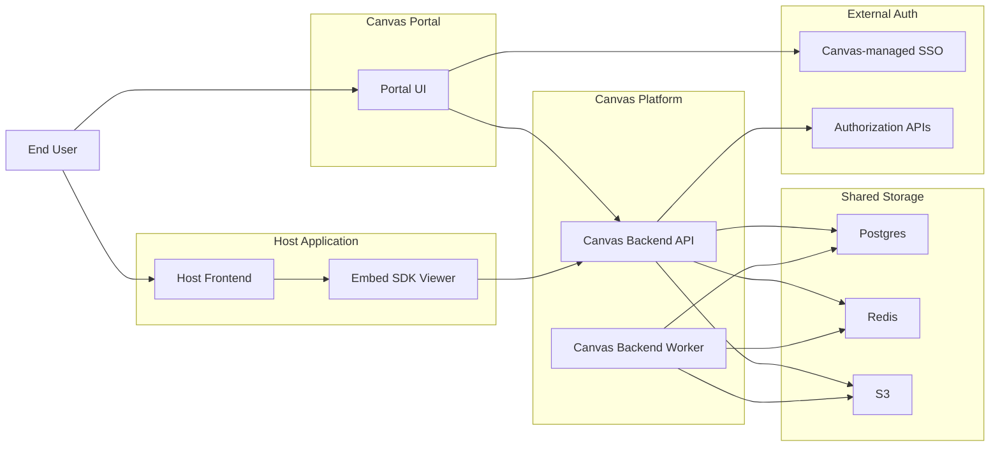

# Canvas Design Spec

Date: 2026-03-23
Status: Current approved product and platform definition
Scope: App-scoped Canvas platform with Portal and Embed SDK Viewer

## 1. Product Summary

`canvas` is a hosted analytics platform that serves two product surfaces:

- `Canvas Portal`
- `Embed SDK Viewer`

`Canvas Portal` is the standalone Canvas web experience where a user signs in, selects an `app`, and manages dashboards through create, edit, share, export, and import actions.

`Embed SDK Viewer` is the host-application integration surface where the same user sees the dashboards they are allowed to access in a given `app`, chooses one, and renders it inside the host product UI.

The backend and storage platform are shared across both surfaces. The core isolation boundary is `app`.

## 2. Goals

### Primary goals

- Support `app`-scoped analytics on shared infrastructure
- Offer a standalone Canvas-managed portal for dashboard management
- Offer an embeddable viewer SDK for host applications
- Use Canvas-managed SSO to obtain `amtoken`
- Translate `amtoken` into user and `app`-scoped authorization through external APIs
- Support dashboard visibility by user, external group, and external role
- Support per-user dashboard selection inside the host application
- Keep data ingestion, query execution, dashboard rendering, and exports in a single hosted platform

### Non-goals for the current product model

- Direct customer-managed database connections
- Dedicated infrastructure per app
- Canvas-managed internal group system
- Full microservice decomposition
- Independent identity truth separate from the external authorization system

## 3. Product Surfaces

### Canvas Portal

Canvas Portal is the management and authoring surface.

It is responsible for:

- Canvas-owned login entrypoint
- app selection for users who can access multiple apps
- dashboard authoring and editing
- dashboard sharing to users, external groups, and external roles
- dashboard export and import flows
- dashboard lifecycle actions such as publish/update

### Embed SDK Viewer

Embed SDK Viewer is the host-facing read and selection surface.

It is responsible for:

- bootstrapping a Canvas session in app context
- listing dashboards visible to the current user in the current app
- persisting and restoring the user's selected dashboard for that app
- rendering dashboards inside the host application

The SDK viewer does not own full dashboard authoring.

## 4. Identity and Access Model

### Core terms

- `app`: the primary isolation boundary, replacing prior `tenant` language
- `principal`: the user identity resolved from external authorization
- `visibility subject`: one of `user`, `group`, or `role`

### Login and authorization flow

1. The user signs in through Canvas-managed SSO.
2. Canvas obtains an `amtoken`.
3. Canvas backend receives `amtoken`.
4. Canvas backend calls external authorization APIs:
   - `GET {auth_base_url}/v1/authorization/current_user`
   - `GET {auth_base_url}/v1/authorization/roles/{app_name}`
5. Canvas translates the external response into principal identity plus app-scoped roles.
6. Canvas issues a short-lived Canvas access token for API and SDK usage.

### Host application path

Host applications may already have `amtoken` in their frontend cookies. The host integration path still uses Canvas backend as the authority that translates token context into Canvas session context.

### Access rules

- every API request is app-scoped
- every background job is app-scoped
- every realtime subscription is app-scoped
- dashboard access is determined by explicit visibility rules
- absence of visibility grant means no access

## 5. Data and Permission Model

### Core entities

- `Application`
- `Principal`
- `AppMembership`
- `Dataset`
- `Workbook`
- `Dashboard`
- `DashboardVisibilityRule`
- `PrincipalAppPreference`

### Dashboard distribution

Each dashboard has two distinct concerns:

- `publication`
  - the dashboard exists as a managed asset in an app
- `visibility`
  - which principals can see it through user, external group, or external role matching

Each user also has an app-scoped preference:

- `selectedDashboardId`

That preference determines which dashboard the SDK viewer should restore inside the host application.

## 6. Runtime Architecture

`canvas` runs as one backend codebase with two runtime modes:

- `API mode`
- `Worker mode`

This keeps deployment and local development simpler while preserving modular boundaries.

### API mode responsibilities

- session exchange
- app context enforcement
- dashboard, workbook, and dataset APIs
- visibility and preference APIs
- realtime gateway

### Worker mode responsibilities

- imports
- normalization
- exports
- asynchronous processing

### Shared infrastructure

- `Postgres`
  - app metadata, principals, memberships, datasets, workbooks, dashboards, visibility rules, preferences, and normalized data
- `Redis`
  - queues, pub/sub, short-lived coordination
- `S3`
  - raw uploads, staged artifacts, exports, snapshots

### External boundary

External SSO and authorization remain outside Canvas. Canvas consumes that system as the source of truth for current user identity and app-scoped role/group information.

## 7. High-Level System Context

## 8. Core System Flows

### Portal login and app selection

1. User signs in through Canvas Portal.
2. Portal obtains `amtoken`.
3. Backend resolves principal identity and available apps.
4. User chooses an app.
5. Backend returns app-scoped session context and access token.

### Visible dashboard lookup

1. Client calls backend in app context.
2. Backend resolves principal identity from Canvas token.
3. Backend loads visibility grants for matching user, external groups, and external roles.
4. Backend returns only dashboards visible to that principal in that app.

### Selected dashboard restore

1. Host application opens Embed SDK Viewer.
2. Viewer requests current user's selected dashboard for the active app.
3. Backend returns saved preference.
4. Viewer renders that dashboard if still visible.

## 9. Design Principles

- `app` is the first-class isolation boundary
- external auth remains the truth source for principal identity and authorization context
- Portal and SDK Viewer are separate product surfaces with distinct responsibilities
- visibility is explicit, not implicit
- system boundaries should stay modular even when deployed as one backend project
