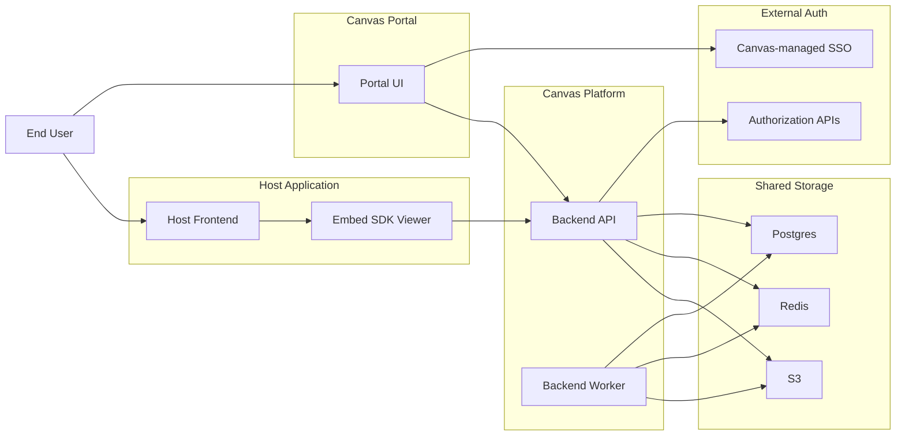

# Canvas Architecture Overview for Leadership

`canvas` is a hosted analytics platform with two user-facing product surfaces:

- `Canvas Portal`
- `Embed SDK Viewer`

The Portal is the standalone Canvas experience for login, app selection, and dashboard management. The SDK Viewer is the host-application integration surface for dashboard selection and display.

## 1. Executive Summary

Canvas is designed as a single hosted platform that serves both standalone and embedded analytics experiences.

In practical terms:

- users sign in through Canvas-managed SSO
- Canvas translates external authorization into app-scoped user context
- Canvas keeps only the active app in a lightweight server-side session
- users can work across multiple apps, but every request is scoped to one active app
- dashboards are shared explicitly by user, external group, or external role
- host applications embed a viewer experience rather than the full management surface

This gives Canvas one consistent operating model while still supporting both Canvas-owned and host-owned product surfaces.

## 2. Product Surfaces

### Canvas Portal

Portal is the management surface.

It is where a user:

- signs in
- selects an app
- creates and edits dashboards
- manages dashboard sharing
- runs export and import actions

### Embed SDK Viewer

The SDK Viewer is the host-facing display surface.

It is where a user:

- opens analytics inside a host product
- sees the dashboards visible to them in the active app
- selects one dashboard for display
- returns to the same dashboard later through a saved per-user preference

## 3. Identity and Authorization Model

Canvas does not own the truth for user identity or app authorization.

Instead:

- Canvas-managed SSO obtains `amtoken`
- Canvas backend calls external authorization APIs
- Canvas caches short-lived `(amtoken, app)` authorization snapshots
- those APIs provide current user identity and app-scoped role information
- external groups remain opaque identifiers owned by the external auth system

Leadership takeaway:

- Canvas centralizes analytics behavior without becoming the system of record for identity
- Canvas session state stays intentionally small, which keeps the platform safer to scale across many users

## 4. Platform Shape

The system is organized into five cooperating areas:

- end user access points
- host application
- Canvas Portal
- Canvas backend platform
- shared storage and external auth systems

## 5. Backend Operating Model

Canvas backend is one codebase with two runtime modes:

- `API mode`
- `Worker mode`

API mode handles:

- session exchange
- app context enforcement
- server-side app session management
- datasets, workbooks, dashboards, visibility, and preference APIs
- realtime communication

Worker mode handles:

- imports
- normalization
- exports
- asynchronous jobs

Leadership takeaway:

- the platform stays operationally simple while keeping API traffic and async workload scalable independently

## 6. Shared Infrastructure Responsibilities

### PostgreSQL

Postgres stores:

- apps
- principals and memberships
- datasets and normalized metadata
- workbooks and dashboards
- dashboard visibility rules
- per-user selected dashboard preferences

### Redis

Redis provides:

- queues
- pub/sub
- short-lived coordination
- app session storage
- authorization cache

### S3

S3 stores:

- raw uploads
- staged import artifacts
- exports
- snapshots

## 7. Dashboard Visibility and Selection

Dashboard access is not global to an app.

A dashboard is visible only when the current principal matches an explicit share rule through one of:

- user
- external group
- external role

Separately, each user has a saved selected dashboard per app. That selection is what the SDK Viewer restores inside the host product.

Leadership takeaway:

- this is what enables different users in the same app to see different dashboards without duplicating the entire app experience

## 8. Operational Summary

The current architecture gives Canvas:

- one hosted analytics platform
- one external auth integration boundary
- one management surface
- one embedded viewer surface
- one shared data and job infrastructure layer

That keeps the platform coherent for users, straightforward to operate, and ready to extend without changing the core model.
