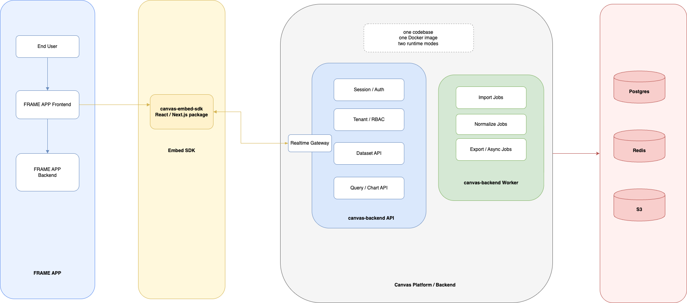

# Canvas Architecture Overview for Leadership

I explain what `canvas` is, why the architecture is designed this way, and what each major part of the system is responsible for

## 1. Executive Summary

`canvas` is a hosted analytics and visualization platform that can be embedded directly into other products.

In practical terms, this means:

- another application can add `canvas` into its own product as a native analytics experience
- its users can upload or receive data, explore it, and build charts and dashboards
- the host application keeps control of its own login and product shell
- `canvas` provides the analytics engine, data handling, and live visualization experience

This architecture is designed to balance three goals:

- make the product feel native inside customer applications
- keep the platform simple enough to ship and operate early
- preserve a clean path to scale the system later

## 2. What Business Problem This Solves

Many applications want to offer rich analytics to their users, but building a full BI product internally is expensive and slow. They often need:

- data upload and normalization
- chart and dashboard creation
- tenant-aware permissions
- live updates
- a UI that feels like part of their own product

`canvas` solves this by acting as a hosted BI platform that customers can embed inside their own application, without having to build and operate the analytics stack themselves.

## 3. Why This Product Is Delivered as an Embedded Platform

The product is intentionally split between an embeddable SDK and a hosted backend platform.

### Why we use an SDK

The SDK is the piece that gets installed into the customer's frontend application.

Its role is to:

- render the analytics UI inside the host product
- inherit the host product's navigation and branding
- communicate with the `canvas` backend
- keep the experience live through realtime updates

This is important because customers do not want analytics to feel like a separate website. They want it to look and behave like a built-in part of their own application.

### Why we host the backend

The backend is hosted and operated by `canvas`.

Its role is to:

- receive and validate user or application data
- normalize and store that data
- execute queries and return chart-ready results
- manage dashboards, workbooks, permissions, and tenant settings
- provide realtime updates to the UI

This is important because it centralizes complexity in one managed platform instead of pushing data processing and analytics infrastructure onto each customer.

## 4. High-Level Architecture

The high-level system is best understood as four cooperating parts:

- the host application
- the `canvas` embedded SDK
- the `canvas` backend platform
- the shared storage and infrastructure layer

### How to read the diagram

- `Host`
  - the customer application and its end users
- `Embed SDK`
  - the frontend package that renders `canvas` inside the customer product
- `Canvas Platform / Backend`
  - the hosted analytics system run by `canvas`
- `Shared Storage`
  - the core storage and coordination systems used by the backend

## 5. Component Roles

### 5.1 Host Application

The host application is the product that embeds `canvas`.

It is responsible for:

- authenticating its own users
- deciding which users can access analytics
- signing a trusted session payload for `canvas`
- optionally pushing application data into `canvas`

This keeps identity ownership with the host product, which is usually what enterprise and SaaS customers expect.

### 5.2 `canvas-embed-sdk`

The SDK is the frontend integration layer.

It is responsible for:

- rendering datasets, charts, dashboards, and analytics workflows
- applying the host application's theme and branding
- exchanging the signed session payload for a `canvas` access token
- calling backend APIs
- maintaining a WebSocket connection for live updates

Leadership takeaway:

- the SDK is what makes `canvas` feel like a native product capability instead of an external tool

### 5.3 `canvas-backend`

The backend is the hosted product core.

We intentionally keep it simple at day one:

- one Node.js/TypeScript backend project
- one Docker image
- two runtime modes

This gives us one platform codebase while still allowing different runtime behavior for user-facing requests and background processing.

#### API mode

API mode is the live application surface.

It is responsible for:

- session exchange and auth validation
- tenant and permission checks
- dataset and dashboard APIs
- chart and query APIs
- realtime gateway for live updates

Leadership takeaway:

- API mode is the interactive brain of the product

#### Worker mode

Worker mode handles asynchronous processing.

It is responsible for:

- import jobs
- data normalization jobs
- export and other background jobs

Leadership takeaway:

- worker mode protects the user experience by moving heavy processing out of the request path

## 6. Why Backend Is One Project but Two Runtime Modes

This is a deliberate simplification.

We are not starting with many microservices because that would add significant overhead in:

- deployment complexity
- debugging complexity
- service-to-service coordination
- version management

Instead, we use:

- one backend project
- one image
- two deployments

This gives us:

- simpler engineering and operations
- consistent releases
- lower early-stage complexity
- the ability to scale API traffic separately from background jobs

Just as importantly, the internal code is still modular. That means we keep the option to split parts of the system into independent services later if growth requires it.

## 7. Shared Infrastructure Responsibilities

The backend relies on three shared infrastructure components.

### PostgreSQL

Postgres is used for:

- tenant and user metadata
- permissions and configuration
- datasets and schema metadata
- normalized analytical data
- dashboards, workbooks, and chart definitions

Leadership takeaway:

- Postgres is both the metadata system and the first-stage analytical store

### Redis

Redis is used for:

- background job queueing
- pub/sub for realtime updates
- caching and short-lived coordination

Leadership takeaway:

- Redis helps keep the product responsive and enables live UX behavior

### S3

S3 is used for:

- raw uploaded files
- staged import artifacts
- exports and snapshots

Leadership takeaway:

- S3 separates raw file handling from transactional application data

## 8. Key Business Flows

### 8.1 User access and embedding

1. The host application logs in its user
2. The host backend signs a trusted session payload
3. The embedded SDK exchanges that payload with `canvas`
4. `canvas` returns a short-lived session token
5. The user can now use analytics inside the host product

What leadership should know:

- this model makes integration easier for customers because they do not need a separate `canvas` login experience

### 8.2 Data ingestion

1. Data is uploaded by the user or pushed by the host application
2. Raw data is stored in S3
3. An import job is queued in Redis
4. Worker mode parses and normalizes the data
5. Normalized data is written into Postgres
6. The dataset becomes available for exploration and charting

What leadership should know:

- this gives us control over data quality, user experience, and chart consistency

### 8.3 Charting and dashboards

1. The user selects a dataset
2. The SDK sends chart or query requests to API mode
3. API mode runs the query on normalized data
4. Results return as chart-ready payloads
5. The user saves workbooks and dashboards

What leadership should know:

- this is the core product value path: data to insight inside the host product

### 8.4 Live updates

The UI stays connected through WebSocket.

This allows the product to show:

- import progress
- query completion
- dashboard refreshes
- other live state changes

What leadership should know:

- this creates a much more premium and modern product experience than a static request/refresh model

## 9. Why This Architecture Fits the Current Stage

This design is intentionally pragmatic.

It is a good fit now because it is:

- `simple enough to ship`
  - one backend project and one image keep delivery manageable
- `strong enough to sell`
  - the product already supports embedding, multi-tenancy, branding, ingestion, dashboards, and live updates
- `clear enough to operate`
  - responsibilities between SDK, API mode, worker mode, and storage are easy to understand
- `flexible enough to scale`
  - modular boundaries are already defined for future service extraction

## 10. Risks and Trade-Offs

Every architecture has trade-offs. The main ones here are:

- `Postgres as day-one analytical storage`
  - simple and available now
  - may need to evolve later for very large analytical workloads

- `Single backend project`
  - simpler to build and operate
  - requires discipline to keep internal boundaries clean

- `Native embedding through SDK`
  - gives the best product experience
  - requires stronger frontend compatibility and SDK maintenance than iframe embedding

These are acceptable trade-offs for the current phase because they favor delivery speed, product quality, and operational simplicity.

## 11. Next Steps and Roadmap

The next implementation phase should focus on:

- backend and frontend project scaffolding
- session and tenancy foundations
- file upload and data normalization pipeline
- dataset exploration and chart rendering
- dashboard persistence
- realtime updates

This sequence gives the team a path to deliver visible product value quickly while keeping the platform architecture aligned with the long-term direction.

## 12. Final Summary

`canvas` is a hosted analytics platform that other applications can embed as a native capability.

The SDK provides the in-product experience.
The backend provides the analytics engine and data platform.
The storage layer provides persistence, job coordination, and raw file handling.

The overall design is intentionally simple at day one, but structured so it can grow into a larger platform over time.
