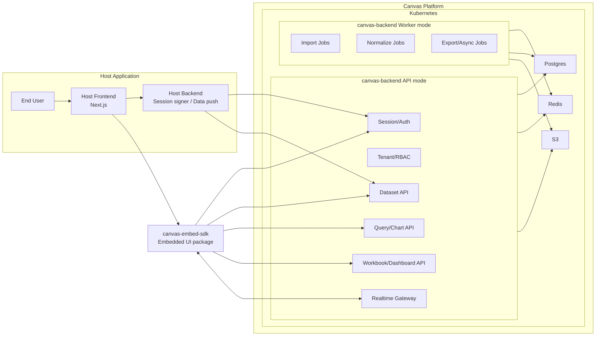

# Canvas High-Level Architecture Revision

Date: 2026-03-17
Status: Approved refinement
Scope: Backend packaging simplification and high-level diagram alignment

## Decision

`canvas` uses a simplified backend packaging model:

- one Node.js/TypeScript backend project: `canvas-backend`
- one Docker image
- two runtime modes
  - `API mode`
  - `Worker mode`

This keeps day-one delivery simple while preserving clean module boundaries for future extraction.

## Why this is the recommended shape

- simpler local development
- simpler CI/CD and image management
- simpler Kubernetes deployment model
- no version skew between API and worker code
- still allows API and background jobs to scale independently

## Internal backend modules

- `auth/session`
- `tenant/rbac`
- `datasets`
- `ingestion`
- `query`
- `charts`
- `workbooks`
- `dashboards`
- `realtime`
- `shared` (`db`, `redis`, `s3`, `config`, `logging`)

## Deployment model

- `canvas-backend-api`
  - runs REST APIs and WebSocket gateway
- `canvas-backend-worker`
  - runs import, normalization, export, and async jobs
- both deployments use the same Docker image with different start commands

## Diagram layout

The high-level draw.io diagram is organized as four vertical swimlanes:

- `Host`
- `Embed SDK`
- `Canvas Platform / Backend`
- `Shared Storage`

This keeps the main traffic paths readable and avoids having connection lines run directly through module labels.

## Mermaid reference

## Implementation note

This revision replaces the earlier “many backend services” presentation at the high level. Internally the code should still keep strong boundaries so we can split services later if scale or team structure demands it.
