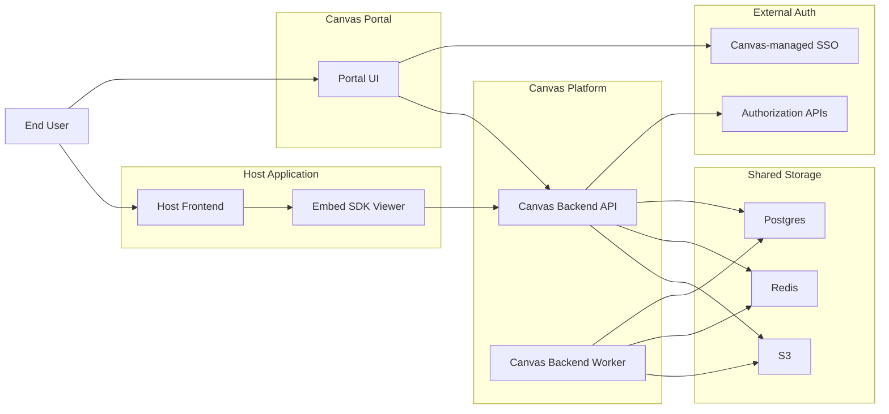

# Canvas High-Level Architecture

Date: 2026-03-23
Status: Current system architecture
Scope: System boundaries for Canvas Portal, Embed SDK Viewer, backend platform, external auth, and shared storage

## Decision

Canvas operates as one hosted platform with two frontend entry surfaces:

- `Canvas Portal`
- `Embed SDK Viewer`

Both surfaces are backed by the same Canvas backend platform, which integrates with external authentication and shared storage systems.

## System areas

The high-level architecture is organized into six system areas:

- `User Access`
- `Host Application`
- `Canvas Portal`
- `Canvas Platform / Backend`
- `External Auth`
- `Shared Storage`

## Component responsibilities

### User Access

- users interact either through Canvas Portal or a host application

### Host Application

- hosts the customer product shell
- mounts the Embed SDK Viewer
- keeps its own product UI and session environment

### Canvas Portal

- owns Canvas login initiation
- lets a user choose an app
- exposes dashboard management operations

### Canvas Platform / Backend

- API mode
  - session exchange
  - app-scoped auth context
  - visibility evaluation
  - dashboard, workbook, and dataset APIs
  - realtime gateway
- Worker mode
  - imports
  - normalization
  - exports
  - async jobs

### External Auth

- Canvas-managed SSO issues `amtoken`
- authorization APIs resolve current user and app-scoped roles
- external groups remain outside Canvas ownership

### Shared Storage

- `Postgres` for app metadata, principals, dashboards, visibility, preferences, and normalized data
- `Redis` for queues and pub/sub
- `S3` for uploads and exports

## Mermaid reference

## Diagram notes

- the diagram is intentionally system-level only
- it does not include detailed user workflows
- `app` is the isolation boundary behind all API and data paths
- both Portal and Viewer depend on the same backend platform
